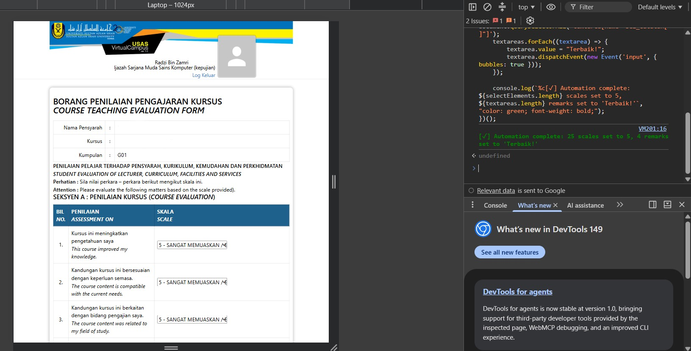

# USAS VC Evaluation Automator

A lightweight automation script to streamline filling out the Course Teaching Evaluation Form on the Universiti Sultan Azlan Shah (USAS) VirtualCampus portal (`http://vcampus.usas.edu.my/`).

## Features
- **Instant Ratings:** Automatically selects `5` (*SANGAT MEMUASKAN / EXTREMELY SATISFACTORY*) for all evaluation criteria.
- **Automatic Remarks:** Populates all comment boxes with a default positive remark (`Terbaik!`).

## How to Use (Browser Console)
1. Navigate to the Course Teaching Evaluation Form page on VirtualCampus.
2. Open your browser's Developer Tools by pressing `F12` (or right-click anywhere and select **Inspect**), then click the **Console** tab.
3. Copy the entire script from [script.js](./script.js), paste it into the console, and press `Enter`.

---

## License
Licensed under the [MIT License](./LICENSE). Feel free to modify and share!

